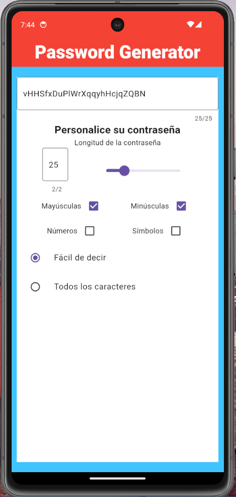
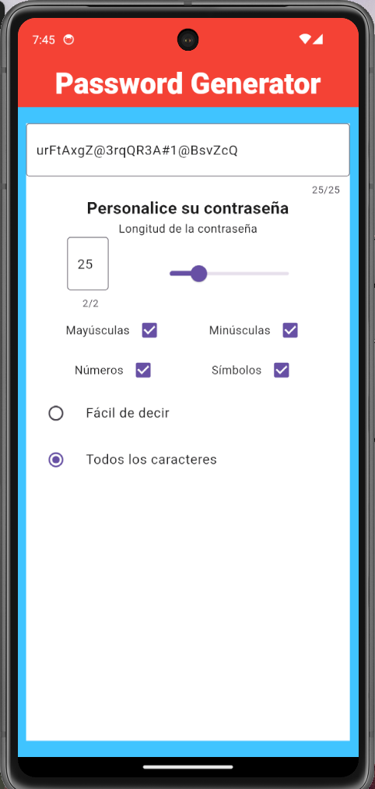

# create_password_app

Este es un proyecto de Flutter para crear una aplicación de generación de contraseñas.

## Descripción

La aplicación permite a los usuarios generar contraseñas seguras y personalizadas de manera rápida y sencilla.

## Características

- Generación de contraseñas seguras con diferentes opciones de personalización.
- Guardado de contraseñas generadas en una lista para su posterior uso.
- Copiado de contraseñas al portapapeles para facilitar su uso en otros lugares.

## Capturas de pantalla

 

## Instalación

1. Clona este repositorio en tu máquina local.
2. Abre el proyecto en tu editor de código preferido.
3. Ejecuta `flutter pub get` para instalar las dependencias.
4. Ejecuta `flutter run` para iniciar la aplicación en tu dispositivo o emulador.

## Contribución

Si deseas contribuir a este proyecto, sigue estos pasos:

1. Haz un fork de este repositorio.
2. Crea una rama con tu nueva funcionalidad: `git checkout -b nueva-funcionalidad`.
3. Realiza los cambios necesarios y realiza un commit: `git commit -m "Agrega nueva funcionalidad"`.
4. Envía tus cambios al repositorio remoto: `git push origin nueva-funcionalidad`.
5. Abre una pull request en este repositorio.

## Licencia

Este proyecto está bajo la Licencia MIT. Consulta el archivo [LICENSE](/path/to/LICENSE) para obtener más información.

## Contacto
Si tienes alguna pregunta o sugerencia, no dudes en abrir un issue o enviarme un correo electrónico a [lejodurango@gmail.com](mailto:youremail@example.com).

